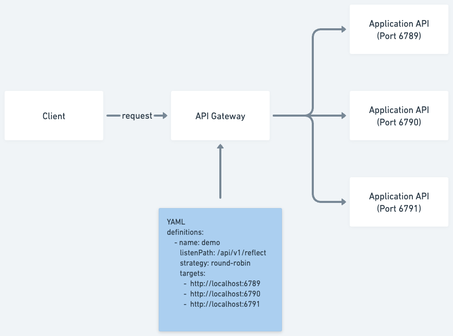
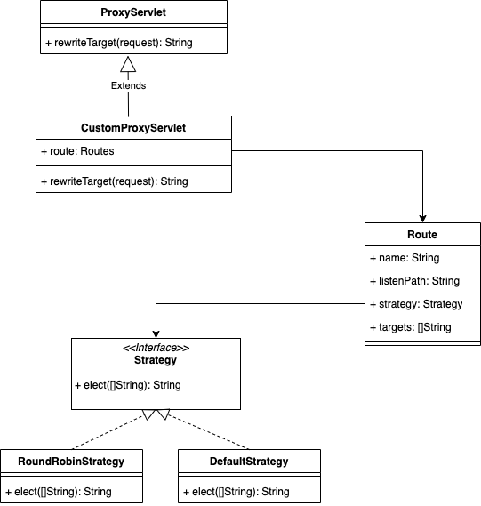

# Architecture


* API Gateway
  * `./gateway`
* Application API
  * `./application`
* Client
  * `./client`
# Design


# Environment Requirements
On Mac/Linux/Windows make sure you have these:
1. Java JDK 8
2. Maven 3+

# Build JAR files
* API Gateway
    ```bash
    $ pwd
    <your_path>/gateway
    $ ./scripts/build.sh
    ```
* Application API
    ```bash
    $ pwd
    <your_path>/application
    $ ./scripts/build.sh
    ```
* Client
    ```bash
    $ pwd
    <your_path>/client
    $ ./scripts/build.sh
    ```
# Execution
* API Gateway
    ```bash
    $ pwd
    <your_path>/gateway
    $ ./scripts/run.sh
    ```
* Application API
    ```bash
    $ pwd
    <your_path>/application
    $ ./scripts/run.sh 6789 instance1
    ```
* Client
    ```bash
    $ pwd
    <your_path>/client
    $ ./scripts/run.sh
    ```
# API SPEC
* POST reflection API
    * path
      * `/api/v1/reflection`
    * request body (any valid json format)
      ```json
      {
        "game": "Mobile Legends",
        "gamerID": "GYUTDTE",
        "points": 20,
        "list": ["i1", "i2"],
        "userInfo": {
          "userID": 123,
          "userName": "Jack"
        }
      }
      ```
    * response
      ```json
      {
        "game": "Mobile Legends",
        "gamerID": "GYUTDTE",
        "points": 20,
        "list": ["i1", "i2"],
        "userInfo": {
          "userID": 123,
          "userName": "Jack"
        }
      }
      ```
    * sample curl
      ```bash
      curl --location 'http://localhost:8080/api/v1/reflection' \
          --header 'Content-Type: application/json' \
          --data '{
            "game": "Mobile Legends",
            "gamerID": "GYUTDTE",
            "points": 20,
            "list": ["i1", "i2"],
            "userInfo": {
              "userID": 123,
              "userName": "Jack"
            }
          }'
      ```